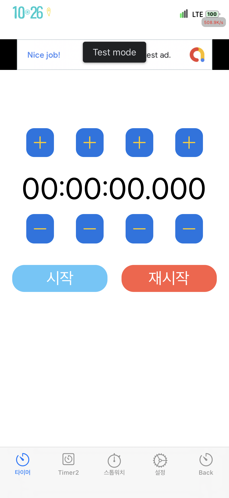
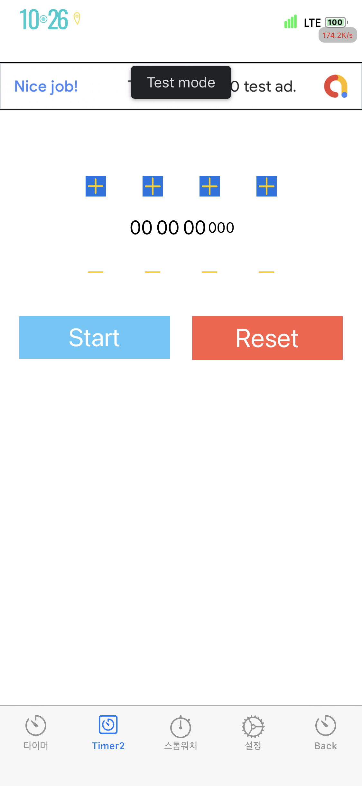
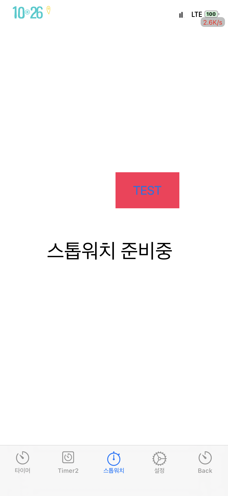
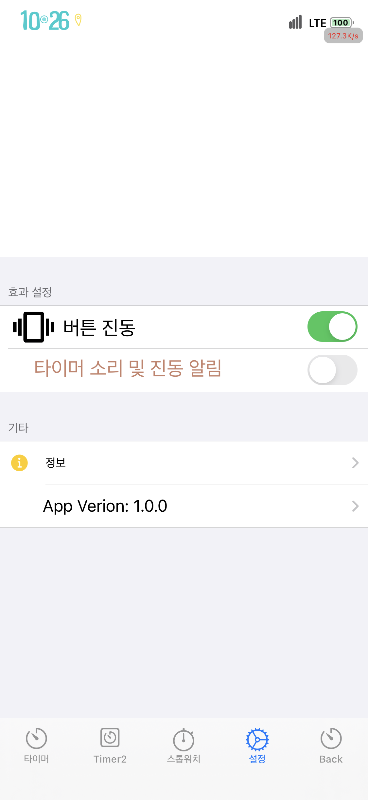
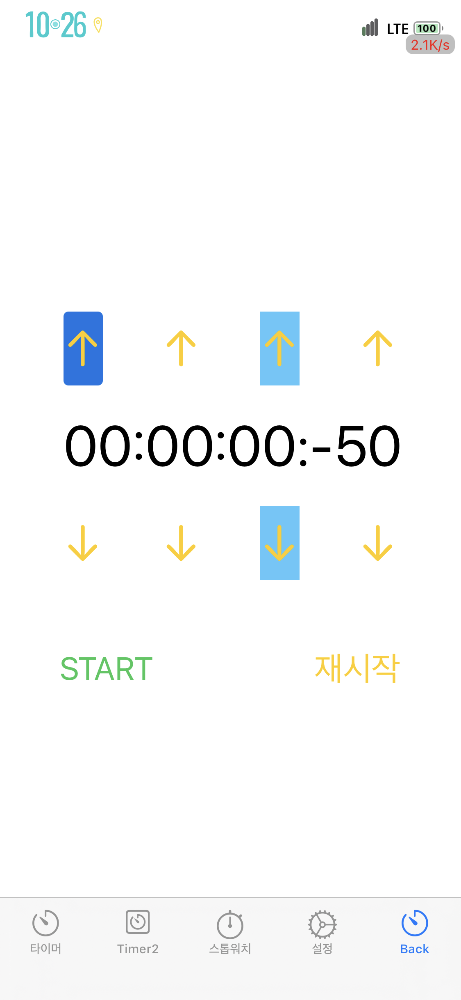

 Timer (iOS Timer App)
===
> 처음으로 만들어보는 iOS 앱
---
## 특징(기능 및 아이디어)
1. 타이머를 밀리초 단위(00::00:00:000)로 시간을 늘리거나 줄일수 있다.(개발완료)
2. 밀리초 단위 카운트 다운이 가능 하다.(개발완료)
3. 밀리초 단위 스톱워치를 사용할 수 있다.(추후)
4. 타이머 완료 소리를 선택할 수 있다.(추후)
5. 자주 사용하는 시간때 타이머를 선택할 수 있다.(00:00:02:008밀리초, 00:00:04:002밀리초를 단축키로 등록하여 바로 타이머를 사용한다는 뜻, 추후)
6. 백그라운트 타이머를 사용할 수 있다. (앱스토어 정책에 따라 변경(현재 백그라운드 활성화됨))
7. 타이머가 끝나면 푸시알림 및 푸시알림을 탭 하였을 때 타이머 화면으로 이동(개발완료)
8. 디바이스를 흔들어서 타이머를 시작 및 종료(추후)
 

## Screenshots 📸 🖼

### 오름차순 기준

| Version |빌드 날짜 
|---------------|---|
|1.4.5|2022년 4월 10일

 

| Version |빌드 날짜 
|---------------|---|
|1.6.0|2022년 6월 10일

 

